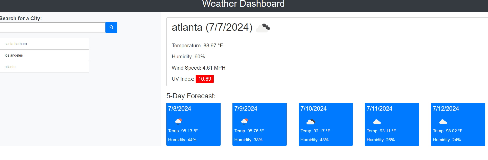

# Weather Dash

## Description

My challenge was to build a weather dashboard that will run in the browser and feature dynamically updated HTML and CSS. The user will be able to see the weather outlook for multiple cities,so that they can plan a trip accordingly.They are able to search for a city,and will be presented with current and future conditions for that city. That city is then added to the search history.Also,the weather icons represent different conditions, temperatures, wind speeds, and humidity levels!

## Link

http://127.0.0.1:5500/index.html

## Screenshot

